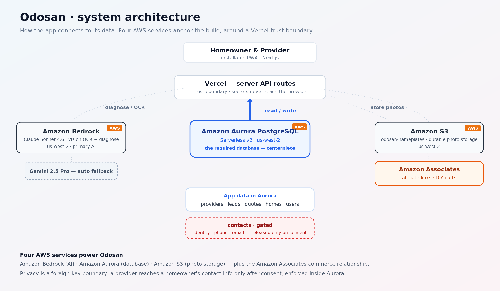
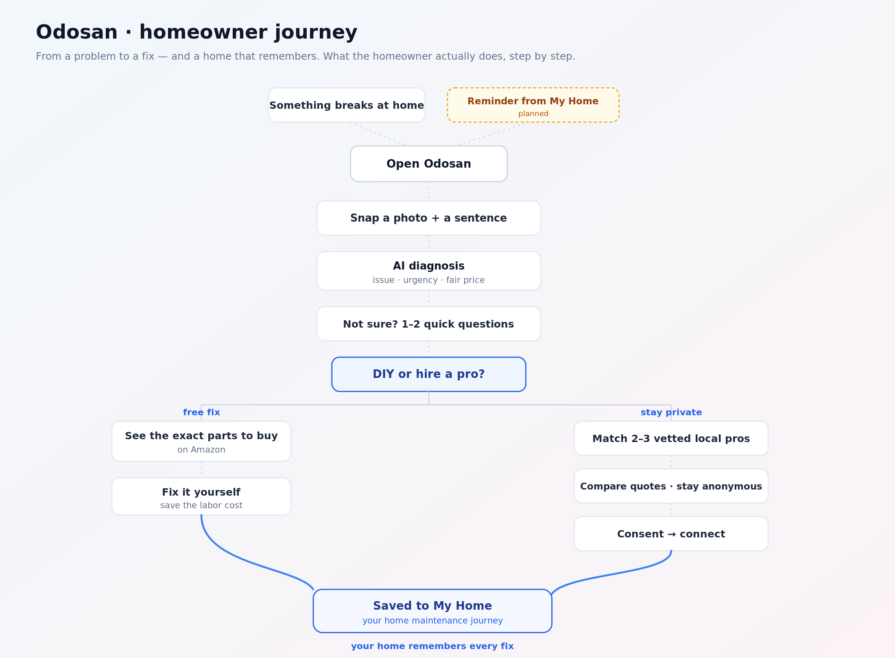

<div align="center">


# Odosan

### The home dad you can call.

**Snap a photo of what's wrong. Get a fair price, a diagnosis, and either the exact parts to fix it yourself — or a vetted local pro who already knows the job.**

[**🌐 odosan.tech**](https://www.odosan.tech) · [Build log on Notion](https://www.notion.so/Odosan-H0-Hackathon-Build-Log-Submission-Vercel-AWS-3832d5cd4ef4811d9403e42eac98ad70) · Built for the **H0 Hackathon** (Vercel v0 + AWS Databases, June 2026)

</div>

---

## What Odosan does

We bought our first home and nobody handed us a manual. The light flickered, the faucet dripped, the yard got away from us — and every time, the same wall: *we don't even know what's wrong, so how do we know who to call, or what's fair?*

Odosan closes that gap. You snap a photo, add a sentence, and an AI trained as a calm, trustworthy home-maintenance expert gives you:

- **Plain-words diagnosis** of what's likely wrong
- **Severity** (urgent / soon / monitor) and a **fair price range** for your area
- **DIY or hire a pro?** — a straight answer, with the exact next step for each path
- **A home record that grows over time** — every diagnosis and every scanned system saved to *My home*

The name **Odosan** comes from お父さん (*otōsan*), Japanese for "father" — the home knowledge a parent passes down. We lost access to it, so we built it.

---

## H0 hackathon submission

> **Q: Which AWS database does this project use?**
> **A: Amazon Aurora PostgreSQL Serverless v2.** Cluster `odosan-aurora`, engine 16.4, region `us-west-2`, scaling 0.5–2 ACUs, fronted by RDS Proxy. Writer instance `odosan-aurora-writer`. Credentials in AWS Secrets Manager.

**Aurora is the centerpiece** — every persistent piece of state in Odosan lives there: providers, leads, quotes, home profiles, territory summaries, better-auth tables, and the user-scoped home record (saved diagnoses + scanned systems).

### Four AWS services power Odosan

| Service | Role |
|---|---|
| **Amazon Aurora PostgreSQL Serverless v2** | Primary data store (the required AWS database) |
| **Amazon Bedrock** (Claude Sonnet 4.6) | Vision OCR on equipment nameplates + diagnose reasoning |
| **Amazon S3** | Durable photo storage (`odosan-nameplates` bucket) |
| **AWS RDS Proxy + Secrets Manager + IAM** | Production connection pooling + credentials |

Plus the **Amazon Associates** commerce relationship for affiliate-tagged DIY part recommendations.

---

## System architecture



The privacy promise is enforced **in the schema, not in policy**: a homeowner's identity and contact info live in a gated relation that a provider can only reach via a consented `lead` row. No service-layer check, no admin override — the database itself is the trust boundary.

```
providers ──┬─ provider_users         (claim a business; UNIQUE)
            └─ provider_areas
homes ──────┬─ home_systems
            └─ home_profiles · territory_summaries
leads:        home_id → provider_id    (problem + neighborhood only — NO contact)
quotes:       lead_id → provider_id    (low/high estimate)
contacts:     released only on homeowner consent
user/session/account/verification    (better-auth via Kysely)
user_home_briefs · user_home_systems (per-user saved record)
```

---

## Homeowner journey



A homeowner opens Odosan (today, or later via a *My home* maintenance reminder), snaps a photo, gets a confident AI diagnosis with a self-reported confidence score and 1–2 clarifying questions when the photo alone isn't enough — then forks into either the **DIY path** (Amazon parts) or the **Pro path** (matched vetted local pros, anonymous until consent). Either way, the brief is saved to *My home* so the homeowner's house remembers every fix.

---

## Tech stack

**Frontend**
- [Next.js 16](https://nextjs.org/) App Router · React 19 · TypeScript · Tailwind CSS v4
- Installable PWA (`manifest.json` + service worker)
- Better-auth for sign-up / sign-in

**Data**
- [Amazon Aurora PostgreSQL Serverless v2](https://aws.amazon.com/rds/aurora/serverless/) in `us-west-2`
- [`pg`](https://node-postgres.com/) driver via RDS Proxy
- [Kysely](https://kysely.dev/) query builder for better-auth integration

**AI**
- [Amazon Bedrock](https://aws.amazon.com/bedrock/) — Claude Sonnet 4.6 inference profile (vision OCR + diagnose reasoning)
- [Google Gemini 2.5 Pro](https://ai.google.dev/) — automatic fallback if Bedrock errors

**Photo storage**
- [Amazon S3](https://aws.amazon.com/s3/) — `odosan-nameplates` bucket, `us-west-2`

**Commerce**
- [Amazon Associates](https://affiliate-program.amazon.com/) — affiliate-tagged Amazon search links for DIY parts (PA-API / Creators API integration shipped end-to-end and dormant pending eligibility)

**Hosting**
- [Vercel](https://vercel.com/) (Next.js production + serverless API routes + Fluid Compute)

---

## Key features

### `/diagnose` — AI home triage

Photo + category + neighborhood → Bedrock Claude returns:
- **Issue name** in plain English
- **Severity**: urgent / soon / monitor
- **Scope of work** a contractor would quote against
- **Fair price range** for the homeowner's area
- **DIY or Pro** recommendation
- **Self-reported confidence** (0-100) with clarifying questions when uncertain
- **DIY shopping query** — Amazon search keywords for the parts a handy homeowner would use

### Result screen — both paths visible

Lead with the recommended path, secondary path always one tap away:
- **DIY** → Amazon parts grid (or affiliate-tagged search link as fallback while affiliate eligibility activates)
- **Pro** → matched vetted local providers in the homeowner's neighborhood

Save the brief to **My home** with one tap — anonymous users use localStorage, signed-in users sync to Aurora.

### `/my-home/document` — nameplate scanning

Snap the silver sticker on a water heater / HVAC condenser / electrical panel — Claude vision extracts:
- Make, model, serial
- Install date (decoded from serial for Rheem, AO Smith, Bradford White, Carrier, Trane, Lennox, Goodman)
- Capacity, fuel type
- **Safety flags** for Federal Pacific Stab-Lok / Zinsco / Pushmatic panels (known fire hazards)

Photos upload to S3 in parallel with the AI call; structured fields persist to Aurora.

### `/my-home` — your home's record

A lightweight, growing record. Anonymous → localStorage. Signed in → Aurora-backed cross-device.
- **Saved diagnoses** — every brief, with severity + DIY/Pro + fair-price recall
- **Scanned systems** — every documented system with age, lifespan, safety flags
- **"✨ Save this across devices"** nudge if anonymous user has data → sign-up triggers localStorage→Aurora migration

### `/for-providers` — coming-soon waitlist

Vetted local service pros join a waitlist. The provider marketplace mechanics (claim a business, see pre-diagnosed leads in their area, submit quotes) are built in the codebase — we're partnering with East Bay trades selectively before opening it.

---

## The privacy story

> **A provider can reach a homeowner's contact info only after the homeowner consents — enforced inside Aurora, not just in policy.**

Trust is the entire pitch. We made it impossible to violate by design:

1. **`leads` table is the only edge between homeowners and providers.** It contains `category`, `problem`, `scope`, `fair_price_range`, `severity`, `neighborhood` — and a foreign key to the chosen provider. **No `name`, no `address`, no `phone`, no `email`.**
2. **Contact data lives in `user` / `homeowner_homes`**, gated behind sign-in.
3. **A provider's query can only join to contact data via a `lead` row** that the homeowner explicitly created.
4. **EXIF/GPS stripping** on photo upload prevents location leaks.

The foreign-key boundary IS the trust boundary.

---

## Quick start

```bash
# 1. Clone
git clone https://github.com/SummerBreezeChang/odosan-web.git
cd odosan-web

# 2. Install deps (uses yarn 4 workspaces)
yarn install

# 3. Set up env vars
cp apps/web/.env.example apps/web/.env.local
# Edit .env.local — see the Environment Variables section below

# 4. Apply the schema to your Aurora cluster
psql "$DATABASE_URL" -f apps/web/db/schema.sql

# 5. Run the home-record migration (creates user_home_briefs + user_home_systems)
curl -X POST http://localhost:3000/api/db-migrate-home-records  # after starting dev

# 6. Run dev server
yarn workspace web dev
# → http://localhost:3000
```

For provisioning Aurora itself from scratch (the AWS CLI walk-through), see [`apps/web/db/AWS_SETUP.md`](apps/web/db/AWS_SETUP.md).

---

## Environment variables

All of these go in `apps/web/.env.local` for local dev, and in **Vercel → Settings → Environment Variables** for production. Mark sensitive ones for Production + Preview environments.

### Required

```bash
# Aurora PostgreSQL connection (point at the RDS Proxy endpoint)
DATABASE_URL="postgres://app:<pass>@odosan-proxy.proxy-xxxx.us-west-1.rds.amazonaws.com:5432/odosan?sslmode=require"

# better-auth
BETTER_AUTH_SECRET="<random-string>"
BETTER_AUTH_URL="https://www.odosan.tech"  # or http://localhost:3000 for dev

# AWS credentials (used for Bedrock + S3)
AWS_ACCESS_KEY_ID="AKIA..."
AWS_SECRET_ACCESS_KEY="..."
AWS_BEDROCK_REGION="us-west-2"
AWS_S3_BUCKET="odosan-nameplates"
AWS_S3_REGION="us-west-2"

# AI fallback if Bedrock isn't available
GEMINI_API_KEY="..."
```

### Optional — Amazon Associates affiliate (Creators API)

```bash
AMAZON_CREDENTIAL_ID="amzn1.application-oa2-client.<hash>"
AMAZON_CREDENTIAL_SECRET="..."
AMAZON_ASSOCIATE_TAG="yourname-20"
# Defaults below cover NA / US marketplace; override only for other regions
AMAZON_MARKETPLACE="www.amazon.com"
AMAZON_OAUTH_TOKEN_URL="https://api.amazon.com/auth/o2/token"
AMAZON_API_BASE_URL="https://creatorsapi.amazon"
AMAZON_OAUTH_SCOPE="creatorsapi::default"
```

When Creators API access isn't yet active (10 qualifying sales / 30 days requirement), the app automatically falls back to affiliate-tagged Amazon search links using `AMAZON_ASSOCIATE_TAG`.

### Optional — Bedrock model override

```bash
BEDROCK_MODEL_ID="us.anthropic.claude-sonnet-4-6-v1:0"  # default; override for other regions/models
```

---

## Repository structure

```
odosan-web/
├── apps/
│   ├── web/                                    Next.js 16 web app (the main project)
│   │   ├── db/
│   │   │   ├── schema.sql                      Postgres schema (run once vs Aurora)
│   │   │   ├── AWS_SETUP.md                    Aurora provisioning guide
│   │   │   └── import-pipeline.mjs             Provider/parcel/territory data ingest
│   │   ├── public/                             PWA manifest + icons (192/512, maskable)
│   │   └── src/
│   │       ├── app/
│   │       │   ├── (app)/                      Public-facing routes
│   │       │   │   ├── diagnose/               AI triage flow
│   │       │   │   ├── my-home/                Saved diagnoses + scanned systems
│   │       │   │   │   └── document/           Nameplate scan flow
│   │       │   │   ├── for-providers/          Service-pro waitlist
│   │       │   │   ├── territory/              ZIP-level demand (provider view)
│   │       │   │   └── provider/               Signed-in provider lead inbox
│   │       │   ├── account/                    Sign-up / sign-in / logout (better-auth)
│   │       │   └── api/
│   │       │       ├── diagnose/               Bedrock + Gemini fallback
│   │       │       ├── diagnose-refine/        Second-pass after clarifying questions
│   │       │       ├── nameplate-extract/      Bedrock vision OCR + S3 upload
│   │       │       ├── amazon-search/          Creators API + affiliate-link fallback
│   │       │       ├── amazon-creators-health/ Diagnostic endpoint for Amazon path
│   │       │       ├── home-record/            User-scoped Aurora persistence
│   │       │       │   ├── brief/              POST /api/home-record/brief
│   │       │       │   ├── system/             POST /api/home-record/system
│   │       │       │   └── migrate/            POST /api/home-record/migrate
│   │       │       ├── db-migrate-home-records One-shot table creation endpoint
│   │       │       └── providers, leads, quotes, my-leads, save-home, ...
│   │       ├── lib/
│   │       │   ├── auth.ts, auth-client.ts     better-auth setup
│   │       │   ├── aws-bedrock.ts              Claude Sonnet 4.6 client (Bedrock InvokeModel)
│   │       │   ├── aws-s3.ts                   S3 photo upload
│   │       │   ├── amazon-creators.ts          Creators API OAuth + SearchItems
│   │       │   ├── amazon-queries.ts           Extracted-system → search-query builder
│   │       │   └── home-record.ts              localStorage + DB sync helpers
│   │       └── components/
│   │           ├── SiteHeader.tsx              Brand wordmark + logo
│   │           ├── BottomNav.tsx               Persistent thumb-zone navigation
│   │           └── SiteFooter.tsx              Privacy / Support / contact
│   └── publisher/                              Provider data pipeline (independent)
├── Odosan-Architecture.png/.svg                System architecture diagram
├── Odosan-Journey.png/.svg                     Homeowner journey diagram
├── package.json                                Yarn 4 workspace root
└── yarn.lock
```

---

## Notable API endpoints

| Method | Path | Purpose |
|---|---|---|
| `POST` | `/api/diagnose` | Bedrock-primary diagnose (Gemini fallback); returns issue + severity + scope + fair price + DIY/Pro + clarifying questions |
| `POST` | `/api/diagnose-refine` | Second pass after homeowner answers clarifying questions |
| `POST` | `/api/nameplate-extract` | Claude vision extracts make/model/install date from a nameplate photo; uploads to S3 |
| `POST` | `/api/amazon-search` | Returns Amazon product grid OR affiliate-tagged search-URL fallback |
| `GET`  | `/api/amazon-creators-health` | One-shot diagnostic for Amazon Creators API config + connectivity |
| `GET`  | `/api/home-record` | Signed-in user's saved diagnoses + scanned systems from Aurora |
| `POST` | `/api/home-record/brief` | Append a brief |
| `POST` | `/api/home-record/system` | Upsert a scanned system |
| `POST` | `/api/home-record/migrate` | Bulk migrate localStorage → Aurora on first sign-in |
| `POST` | `/api/leads` | Create a lead (matched provider) |
| `POST` | `/api/quotes` | Provider-side: submit estimate on a lead |
| `GET`  | `/api/providers` | Public: matched providers for a category + neighborhood |

---

## How money flows

Odosan is **free for homeowners** and aligned with their interests on both revenue streams:

1. **Finding fee from providers** — when Odosan matches a homeowner to a pro and the homeowner connects, the provider pays a small finding fee for the pre-qualified, ready-to-hire lead.
2. **Amazon affiliate commission** — when a homeowner buys recommended parts through the DIY path, Odosan earns a small commission. The homeowner pays nothing extra.

Both streams reward Odosan for **giving the homeowner the right answer**, not for steering them toward the more expensive option.

---

## Roadmap

- **Proactive home health.** Use `home_profiles` + `territory_summaries` to send gentle reminders like *"your roof is heading into its 20s — worth a look before the rains."*
- **Maintenance journey timeline.** A clear visual of what's due in the next 30 / 90 / 365 days based on system ages.
- **Masked contact relay (Twilio)** — homeowner and provider connect without sharing real phone numbers until the homeowner consents.
- **Live provider data (Google Maps Platform)** — replace seed provider data with canonical Google Business Profile listings.
- **Rebate-aware upgrade math** — IRA federal credits + PG&E + BayREN rebates baked into replacement cost estimates.
- **Amazon Creators API activation** — full product-grid renders the moment the affiliate account hits 10 qualifying sales / 30 days.

---

## Acknowledgments

Built by [Summer Chang](https://github.com/SummerBreezeChang) for the **H0 "Hack the Zero Stack" Hackathon** (June 2026 · Vercel v0 + AWS Databases track).

The privacy-first marketplace mechanics were inspired by every homeowner who's been quoted three wildly different prices for the same job.

---

## License

This project was created for the H0 Hackathon. Code license to be added post-hackathon.

For partnership, hiring, or just to say hi:
- Web: [odosan.tech](https://www.odosan.tech)
- Build log: [Notion](https://www.notion.so/Odosan-H0-Hackathon-Build-Log-Submission-Vercel-AWS-3832d5cd4ef4811d9403e42eac98ad70)
